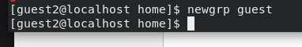

---
## Front matter
lang: ru-RU
title: Презентация по лабораторной работе №3
subtitle: Основы информационной безопасности
author:
  - Мажитов М. А.
institute:
  - Российский университет дружбы народов, Москва, Россия
date: 21 сентября 2024

## i18n babel
babel-lang: russian
babel-otherlangs: english

## Fonts
mainfont: PT Serif
romanfont: PT Serif
sansfont: PT Sans
monofont: PT Mono
mainfontoptions: Ligatures=TeX
romanfontoptions: Ligatures=TeX
sansfontoptions: Ligatures=TeX,Scale=MatchLowercase
monofontoptions: Scale=MatchLowercase,Scale=0.9

## Formatting pdf
toc: false
toc-title: Содержание
slide_level: 2
aspectratio: 169
section-titles: true
theme: metropolis
header-includes:
 - \metroset{progressbar=frametitle,sectionpage=progressbar,numbering=fraction}
 - '\makeatletter'
 - '\beamer@ignorenonframefalse'
 - '\makeatother'
---

## Докладчик

:::::::::::::: {.columns align=center}
::: {.column width="70%"}

  * Мажитов Магомед Асхабович
  * студент группы НКНбд-01-21
  * Российский университет дружбы народов

:::
::: {.column width="30%"}


:::
::::::::::::::

## Цель

Получить практические навыки работы в консоли с атрибутами файлов для групп пользователей.

## Выполнение лабораторной работы. 


Создаю гостевые учетные записи *guest* и *guest2*, а также задаю им пароли.

{ #fig:001 width=70% }

##

Добавляю пользователя *guest2* в группу guest.

{ #fig:002 width=70% }

##

Выполнил вход в систему от двух пользователей на двух разных консолях: *guest* на первой консоли и *guest2* на второй консоли. Далее определил директорию, в котором мы находимся, для каждого пользователя с помощью команды *pwd*.(

{ #fig:003 width=40% }

{ #fig:004 width=40% }

##

С помощью команды *whoami* уточнил имя пользователя в каждом терминале.

{ #fig:005 width=70% }

##

Определил командами *groups guest* и *groups guest2*, в какие группы входят пользователи *guest* и *guest2*. 

{ #fig:006 width=40% }

Как мы видим на скриншоте, *guest2* входит в группы *guest2*(созданная автоматически) и *guest*(добавили вручную), а *guest* входит в группу *guest*.

##

С помощью команды *cat /etc/group | grep 'guest'* вывел интересующую нас информацию файла *group*.

{ #fig:007 width=70% }

##

От имени пользователя *guest2* выполнил регистрацию пользователя *guest2* в группе *guest* командой *newgrp guest*.

{ #fig:008 width=70% }

##

 От имени пользователя *guest* измените права директории */home/guest*, разрешив все действия для пользователей группы.

{ #fig:009 width=70% }

##

От имени пользователя guest снял с директории */home/guest/dir1* все атрибуты командой *chmod 000 dirl*.

{ #fig:010 width=70% }

## Заполнение таблицы 3.2

На основе таблицы 3.1 заполняю таблицу 3.2. «Минимальные права для совершения операций от имени пользователей входящих в группу»

| Операция | Права на директорию | Права на файл |
|------------------------|---------------------------------|---------------------------|
| Создание файла | ```d----wx-— (030)``` | ```--------— (000)``` |
| Удаление файла | ```d----wx-— (030)``` | ```--------— (000)``` |
| Чтение файла | ```d-----x-— (010)``` | ```----r---— (040)``` |
| Запись в файл | ```d-----x-— (010)``` | ```-----w--— (020)``` |
| Переименование файла | ```d----wx-— (030)``` | ```--------— (000)``` |
| Создание поддиректории | ```d----wx-— (030)``` | ```--------— (000)``` |
| Удаление поддиректории | ```d----wx-— (030)``` | ```--------— (000)``` |

## Вывод

Были получены практические навыки работы в консоли с атрибутами файлов для групп пользователей.

## Список литературы. Библиография

[0] Методические материалы курса

[1] Права доступа: https://codechick.io/tutorials/unix-linux/unix-linux-permissions

[2] Группы пользователей: https://losst.pro/gruppy-polzovatelej-linux#Что_такое_группы

:::
