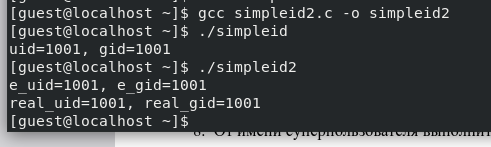
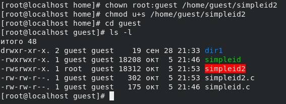
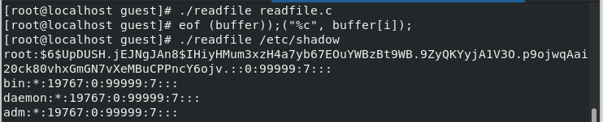

---
## Front matter
lang: ru-RU
title: Презентация по лабораторной работе №5
subtitle: Основы информационной безопасности
author:
  - Мажитов М. А.
institute:
  - Российский университет дружбы народов, Москва, Россия
date: 28 сентября 2024

## i18n babel
babel-lang: russian
babel-otherlangs: english

## Fonts
mainfont: PT Serif
romanfont: PT Serif
sansfont: PT Sans
monofont: PT Mono
mainfontoptions: Ligatures=TeX
romanfontoptions: Ligatures=TeX
sansfontoptions: Ligatures=TeX,Scale=MatchLowercase
monofontoptions: Scale=MatchLowercase,Scale=0.9

## Formatting pdf
toc: false
toc-title: Содержание
slide_level: 2
aspectratio: 169
section-titles: true
theme: metropolis
header-includes:
 - \metroset{progressbar=frametitle,sectionpage=progressbar,numbering=fraction}
 - '\makeatletter'
 - '\beamer@ignorenonframefalse'
 - '\makeatother'
---

## Докладчик

:::::::::::::: {.columns align=center}
::: {.column width="70%"}

  * Мажитов Магомед Асхабович
  * студент группы НКНбд-01-21
  * Российский университет дружбы народов

:::
::: {.column width="30%"}

:::
::::::::::::::

## Цель

Изучение механизмов изменения идентификаторов, применения SetUID- и Sticky-битов. Получение практических навыков работы в консоли с дополнительными атрибутами. Рассмотрение работы механизма смены идентификатора процессов пользователей, а также влияние бита Sticky на запись и удаление файлов.

## Выполнение лабораторной работы. 

Проверил установлен ли компилятор *gcc* и *g++*.

{ #fig:001 width=70% }

##

Вошел в систему от имени пользователя guest и создал программу simpleid.c.

{ #fig:002 width=50% }

{ #fig:002 width=50% }

##

Скомплилировал программу и убедился, что файл программы создан. Далее запустил исполнительный файл, а также ввел системную программу *id* для дальнейшего сравнения выводов. 

{ #fig:003 width=70% }

Результаты идентичны.

##

Создал программу *simpleid2.c*.

{ #fig:005 width=70% }

{ #fig:002 width=50% }

##

Скомпилоровал программу и сравнил выводы прошлой и новой программ.

{ #fig:006 width=70% }

##

Далее я поменял владельца файла *simpleid2* и изменил права доступа к нему.

{ #fig:007 width=70% }

##

Запустил *simpleid2* и *id*.

{ #fig:008 width=70% }

Как мы видим после изменения владельца *simpleid2*, вывод программы изменился.

##

Создал программу *readfile.c*. Скомпилировал файл и далее также изменил владельца *readfile* и права доступа к нему, так, чтобы только суперпользователь(root) мог прочитать его, a guest не мог.

{ #fig:009 width=70% }

##

 Попробовал прочитать файл от имени *guest*. 

{ #fig:010 width=70% }

Попытка не увенчалась успехом.

##

Проверил, может ли программа readfile прочитать файл *readfile.c* и */etc/shadow*.

{ #fig:010 width=70% }

##

Проверил, установлен ли атрибут *Sticky* на директории /tmp. 

{ #fig:010 width=70% }

##

От имени пользователя *guest* создал файл *file01.txt* в директории */tmp* со словом test и изменил права доступа к нему. 

{ #fig:010 width=70% }

##

От пользователя guest2 (не являющегося владельцем) попробовал прочитать файл, переписать содержимое файла, а также дописать в файл новые данные. 

{ #fig:010 width=70% }

##

Попробовал удалить файл. 

{ #fig:010 width=70% }

##

Повысив права до суперпользователя, снял атрибут *t*. 

{ #fig:010 width=70% }

##

Повторил действия из пунктов **13-14**. 

{ #fig:010 width=70% }

В этот раз получилось удалить *file01.txt*.

##

Попробовал удалить файл. 

{ #fig:010 width=70% }

## Вывод

Изучил механизм изменения идентификаторов, применил SetUID- и Sticky-биты. Получил практические навыки работы в консоли с дополнительными атрибутами. Рассмотрел работы механизма смены идентификатора процессов пользователей, а также влияние бита Sticky на запись и удаление файлов.

## Список литературы. Библиография

::: {#refs}
:::