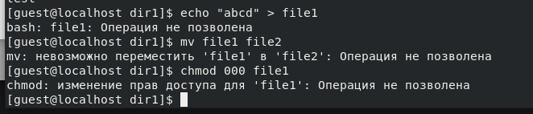

---
## Front matter
lang: ru-RU
title: Презентация по лабораторной работе №4
subtitle: Основы информационной безопасности
author:
  - Мажитов М. А.
institute:
  - Российский университет дружбы народов, Москва, Россия
date: 28 сентября 2024

## i18n babel
babel-lang: russian
babel-otherlangs: english

## Fonts
mainfont: PT Serif
romanfont: PT Serif
sansfont: PT Sans
monofont: PT Mono
mainfontoptions: Ligatures=TeX
romanfontoptions: Ligatures=TeX
sansfontoptions: Ligatures=TeX,Scale=MatchLowercase
monofontoptions: Scale=MatchLowercase,Scale=0.9

## Formatting pdf
toc: false
toc-title: Содержание
slide_level: 2
aspectratio: 169
section-titles: true
theme: metropolis
header-includes:
 - \metroset{progressbar=frametitle,sectionpage=progressbar,numbering=fraction}
 - '\makeatletter'
 - '\beamer@ignorenonframefalse'
 - '\makeatother'
---

## Докладчик

:::::::::::::: {.columns align=center}
::: {.column width="70%"}

  * Мажитов Магомед Асхабович
  * студент группы НКНбд-01-21
  * Российский университет дружбы народов

:::
::: {.column width="30%"}

:::
::::::::::::::

## Цель

Получение практических навыков работы в консоли с расширенными атрибутами файлов.

## Выполнение лабораторной работы. 

От имени пользователя guest определил расширенные атрибуты файла *file1*.

{ #fig:001 width=70% }

##

Установил командой *chmod 600 file1* на файл *file1* права, разрешающие чтение и запись для владельца файла. Далее попробовал установить на файл *file1* расширенный атрибут *a* от имени пользователя *guest*.

{ #fig:002 width=70% }

##

Открываю новую вкладку терминала и захожу с правами администратора. Пробую установить на файл *file1* расширенный атрибут *a*.

{ #fig:003 width=70% }

##

От пользователя *guest* проверяю правильность установления атрибута.

{ #fig:005 width=70% }

##

Выполнил дозапись в файл *file1* слова *test*.

{ #fig:006 width=70% }

##

Попробовал стереть имеющуюся в нём информацию, переименовать файл, а также изменить права доступа к файлу.

{ #fig:007 width=70% }

Как мы видим по скриншоту, попытки не увенчались успехом.

##

Снял расширенный атрибут *a* с файла *file1* от имени суперпользователя.

{ #fig:008 width=70% }

##

Попробовал повторить операции из пункта **6**.

{ #fig:009 width=70% }

С измененными расширенными атрибутами все операции выполнились успешно.

##

Повторил пункты **3-6** по шагам, заменив атрибут «a» атрибутом «i». 

{ #fig:010 width=70% }

{ #fig:010 width=70% }

Как и в прошлый раз, попытки не увенчались успехом.

## Вывод

В результате выполнения работы мы повысили свои навыки использования интерфейса командой строки, познакомились на примерах с тем, как используются основные и расширенные атрибуты при разграничении доступа.

## Список литературы. Библиография

[0] Методические материалы курса

[1] Права доступа: https://codechick.io/tutorials/unix-linux/unix-linux-permissions

[2] Расширенные атрибуты: https://ru.manpages.org/xattr/7

[3] Операции с расширенными атрибутами: https://p-n-z-8-8.livejournal.com/64493.html

:::
